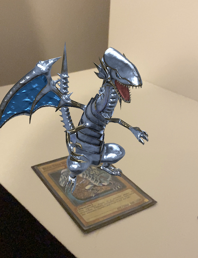
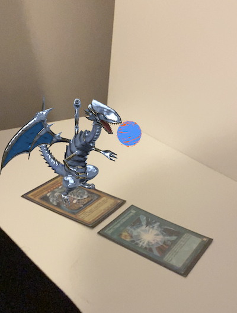

# YugiohAR

YugiohAR is a mobile application that can track the images of some Yugioh cards.

## Description

- **SceneKit** used for image tracking and animations.

## Screenshots

## License

**YugiohAR** is available under the MIT license. See the LICENSE file for more info.

## Authors

- [@tahabozdemir](https://www.github.com/tahabozdemir)

## Support Me 

Please contact me if you find any bad code, I am eager to learn more. E-mail taha@bozdemir.net

## Credits

- [Blue-Eyes White Dragon Model](https://sketchfab.com/3d-models/blue-eyes-white-dragon-yu-gi-oh-6ab793b28ded4e41b33e195e91aa06aa)
- [Dark Hole Model](https://sketchfab.com/3d-models/black-hole-cfd16738ad2c402b9dc8e38a9c05c8d4)
- [Burst Stream of Destruction Model](https://sketchfab.com/3d-models/fireball-vfx-911322f594b2480e8c3f9d49ff7619c6)
